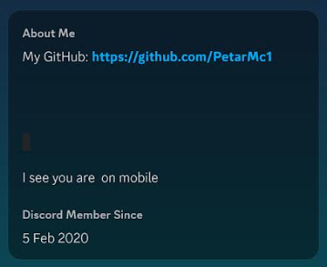
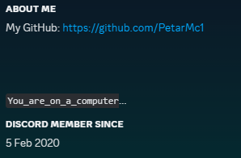

# About Me -> What platform you are on

There is a way to tell a user if he is on mobile or computer. It is used it the About Me section of a Discord Profile.

````
My about me can tell what device you are using


```You_are_on_a_computer
 
```
You are on mobile
````

If you are changing the `You_are_on_a_computer` thing be aware that it needs:

* To start with a uppercase
* To replace all spaces with \_

You can add more text at the top but you need to check if the platform message shows. if it doesn't add or remove some of the rows between the `You_are_on_a_computer` and  the text at the top

<div align="left">

<figure><figcaption><p>When you are on mobile</p></figcaption></figure>

</div>

<div align="left">

<figure><figcaption><p>When you are on pc</p></figcaption></figure>

</div>
