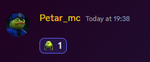

# Sending blank attachments

One of the many ways to troll your friends is by sending a "blank" attachment. It is a 1x1px image. If you react to the message that has that attachment it looks weird. You can find the image and other trolls here [https://github.com/PetarMc1/discord-trolls](https://github.com/PetarMc1/discord-trolls)

<figure><figcaption>
Reaction to a "blank" attachment
</figcaption></figure>

