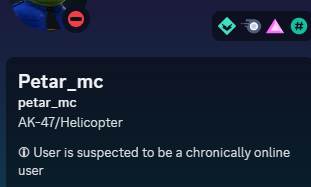

# Warrning

You can set a custom status, for example, saying that you are suspected for something. I do recommend putting something like that you are suspected of being in a terrorist organization. Put the 🛈 symbol.

<figure><figcaption>
Example status
</figcaption></figure>

