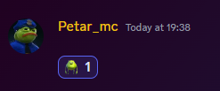

# Sending blank attachments

One of the many ways to troll your friends is by sending a "blank" attachment. It is a 1x1px image. If you react to the message that has the attachment it looks weird. You can find the image in the GitHub repo

<figure><figcaption>
Reaction to a "blank" attachment
</figcaption></figure>

